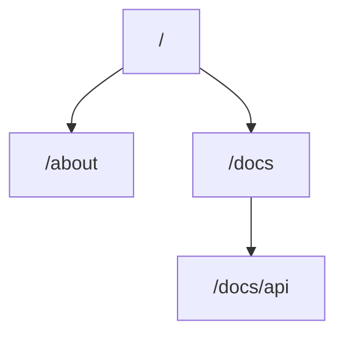

# Routes

enrouter is a file based router.
You define routes by creating tree of folders and files.

Folders in the tree declare url segments.
Files define UI content which is displayed for corresponding url segment.

## \_layout.tsx

todo

## \_content.tsx

todo

## \_void.tsx

todo
