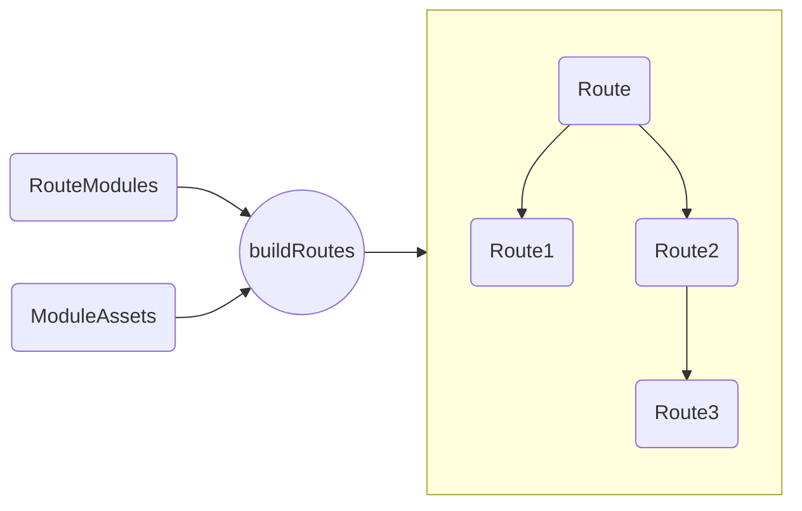

# Building Routes

Will soon be updated...

```mermaid
graph LR;
  RM(RouteModules)
  MA(ModuleAssets)
  BR((buildRoutes))
  subgraph RTT [" "]
    RT(Route)
    RT1(Route1)
    RT2(Route2)
    RT3(Route3)

    RT-->RT1
    RT-->RT2
    RT2-->RT3
  end

  RM-->BR
  MA-->BR
  BR-->RTT
```
