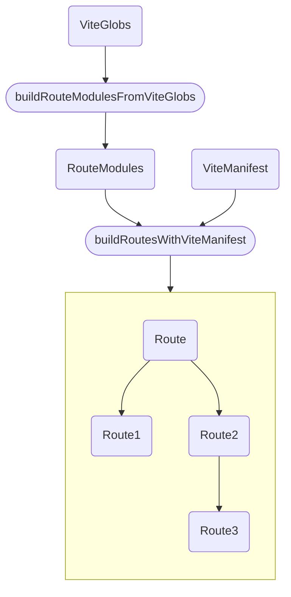

# Building Routes

See also: [RouteModules](/docs/api/modules), [Route](/docs/api/route).

```mermaid
graph TB
  VG(ViteGlobs)
  VM(ViteManifest)
  BRM([buildRouteModulesFromViteGlobs])
  RM(RouteModules)
  BR([buildRoutesWithViteManifest])
  subgraph RTT [" "]
    direction TB

    RT(Route)
    RT1(Route1)
    RT2(Route2)
    RT3(Route3)

    RT-->RT1
    RT-->RT2
    RT2-->RT3
  end;

  VG-->BRM
  BRM-->RM
  RM-->BR

  VM-->BR

  BR-->RTT
```
