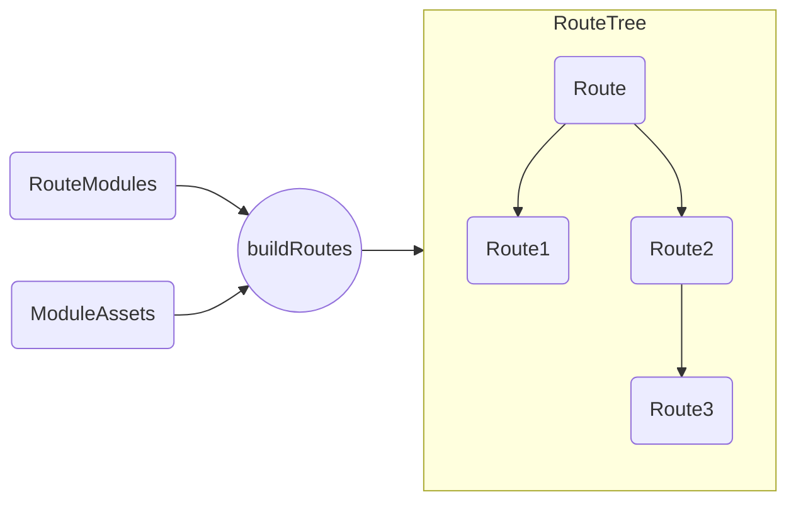
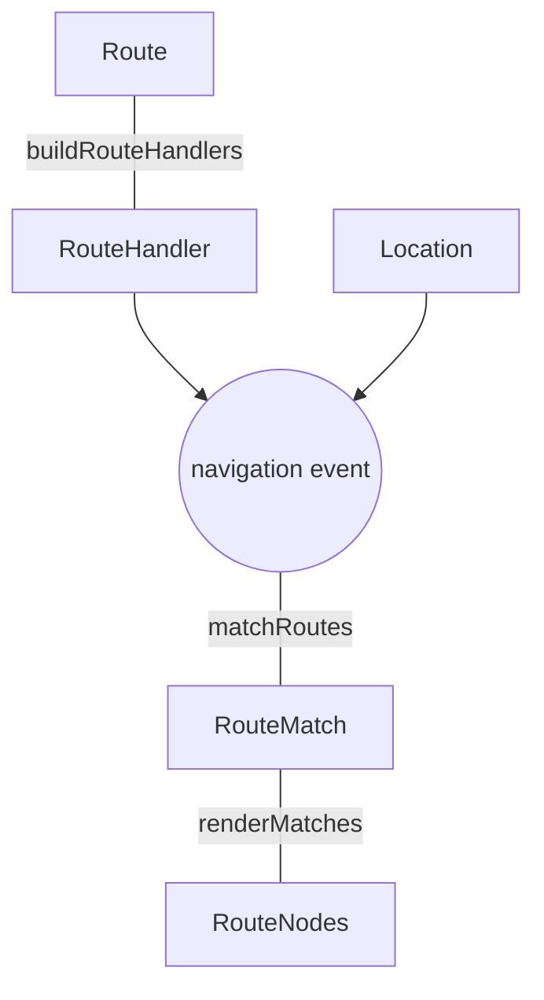

# Architecture

## Building Routes

```mermaid
graph LR;
  RM(RouteModules)
  MA(ModuleAssets)
  BR((buildRoutes))
  subgraph R [RouteTree]
    direction TB
    RT(Route)
    RT1(Route1)
    RT2(Route2)
    RT3(Route3)

    RT-->RT1
    RT-->RT2
    RT2-->RT3
  end

  RM-->BR
  MA-->BR
  BR-->R
```

## Building RouteHandlers

TODO

## TODO

```mermaid
graph TD;
  RT[Route];
  RH[RouteHandler];
  NAV(("navigation event"));
  LOC[Location];
  RM[RouteMatch];
  RN[RouteNodes];

  RT---|buildRouteHandlers|RH;
  RH-->NAV;
  LOC-->NAV;
  NAV---|matchRoutes|RM;
  RM---|renderMatches|RN;
```
