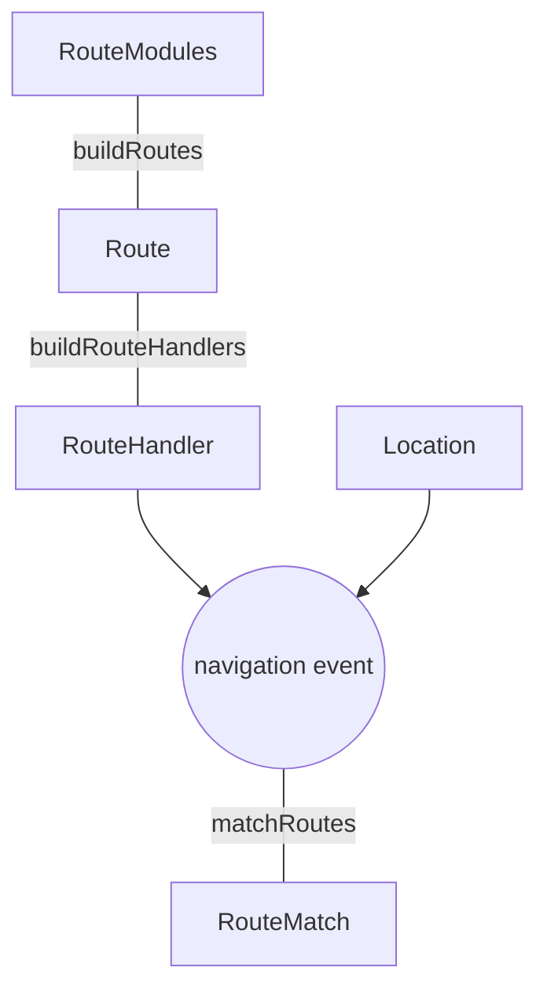

# enrouter

```mermaid
graph TD;
  MM[RouteModules];
  RT[Route];
  RH[RouteHandler];
  NAV(("navigation event"));
  LOC[Location];
  RM[RouteMatch];

  MM---|buildRoutes|RT;
  RT---|buildRouteHandlers|RH;
  RH-->NAV;
  LOC-->NAV;
  NAV---|matchRoutes|RM;
```
